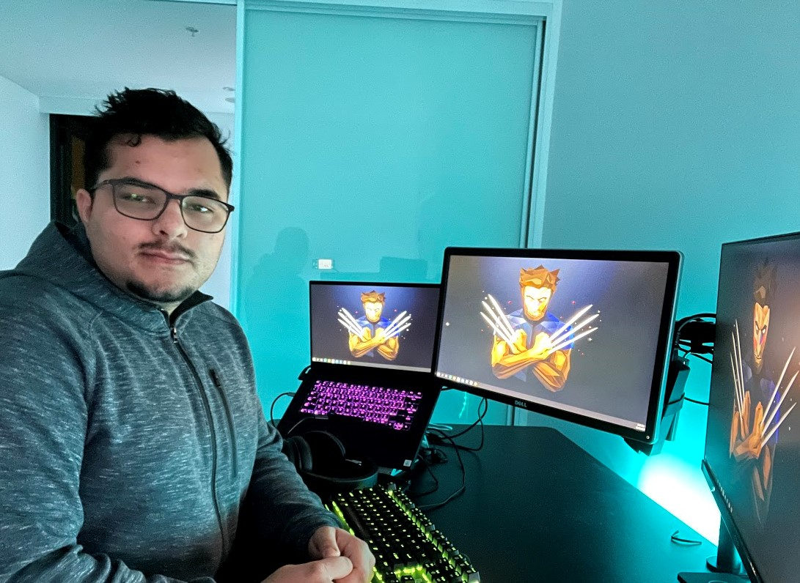

### Summary
I'm Samrat. A Network security Engineer with focus on Network, systems and security operations. Having hands on experience in cloud and security solutions design and deployment for small organisations and datacentre operations for large enterprises. Skilled in Cisco devices, Checkpoint, Palo alto firewalls and Google Cloud Workspace.

### Education
##### Bachelor of Engineering (ICT) Hons.  Network Security   
#### University of Technology Sydney  (Jun 2016 - Nov 2019)
-	ICT Capstone Project: Real-time cyber-attack detection using deep learning (High Distinction)
-	Software Engineering Practice (High Distinction)
-	Network Planning and Management (Distinction)

### Experience

##### Associate Infrastructure Services specialist (DC Network Sevices)				
#### Westpac  (Sept 2021 – Present)
-	Provide level 2 and 3 troubleshooting for data centre routing and switching technologies, including but not limited to VXLAN Fabric network, BGP, OSPF, STP and various networking devices.
-	Design and development of automation modules and playbooks for configuration deployment and changes of Data centre network related to above-mentioned technologies using Ansible, Terraform, DCNM.
-	Interpreting specification and engineering diagrams for configuration and deployment of lab environments and escalate design issues.
-	Monitoring performance of networking equipment’s for any operational issues and perform preventative maintenance.
-	Liaise with telecommunications providers and vendors for smooth operation of critical systems infrastructure.

##### Associate Analyst Network Operations (Operations Command Centre)				
#### Mastercard  (June 2020 – Sept 2021)
-	Monitor and troubleshooting routing issues across various layers including physical, capacity, BGP, DMVPN, HSRP, MPLS, IWAN and PFR.
-	Perform risk analysis and take corrective actions for incidents while minimizing service impacts on Mastercard’s site and globally distributed datacentres.
-	Perform routine maintenance and rollout updates to systems as per policy and procedure.
-	Analyse all systems run as per design during and after planned maintenance and implementations window.
-	Triage and escalate issues to various stakeholders such as service providers, regional engineering and management team. 

##### Operations and Technology Intern (Global Network Engineering) 	      	      		              
#### Mastercard   (Nov 2018 - Feb 2019)
-	Analysed network architecture and security policy for network changes and assisted in changes and validation.
-	Led and assisted the team on the transition to the latest ITSM tool BMC Remedy.
-	Coordinated vulnerability assessment and remediation on applications and components to re-certify PCI-DSS compliance requirements using RSA archer.
-	Configured cisco core and distribution switches, Palo-alto firewalls. 

### Technical Experience

##### Networking Skills  
-	In-depth understanding of OSI-Layer model, including thorough knowledge of TCP/IP, BGP, OSPF, MPLS; developed from professional experiences and university courses.
-	Configuration of cisco switches and Palo alto firewall as per companies’ policies.
-	Good understanding of implementing firewall policies and auditing for usage.

##### Cyber Security Skills  
-	Excellent knowledge on cyber-attacks and defences, web security, firewalls and intrusion detection systems. 
-	Solid understanding of Confidentiality, Integrity and Availability (CIA), threat modelling and mitigation. 
-	Penetration testing skills using Kali Linux, Burp suite, Nmap, Metasploit frameworks, active directory attacks, privilege escalation in Linux and Windows machines and research skills.
-	Threat hunting skills using open source SEIM tools, installation and using Bro tool, Argus, Security Onion, Logstash, Elastic search.
#####   Programming Skills  
-	Experience in developing backend web application development using spring boot, python, OpenCV, Keras, MATLAB. Developed from professional experience and university courses 
-	Developed Frontend web application using React and Agile Methodology from university courses.  
-	Very good understanding of Software design principles, various architecture and agile methodology.
-	Developed Linux process capture https://github.com/samurato/DigitalForensics and network capture tools https://github.com/samurato/Deepwall using python. 
##### Deep learning and Computer Vision
-	In depth understanding and implementation of various Neural Networks architecture such as RNN, CNN, SSD, GAN, SOM, Boltzmann machines and DBN from university courses. 
-	Excellent understanding of TensorFlow, applied SSD for Hazard Detection and Real time cyber-attack detection using Deep Belief Networks which produced 94% accuracy https://medium.com/@samrat.sammie/applying-the-deep-belief-network-dbn-in-credit-card-fraud-detection-13086716e7f8

### Certifications and Licenses
-	Penetration Testing Essential Training (Linked in learning).
-	Splunk Fundamentals 1, Autopsy 1-day hands on class.        
-	ACS member: 4276024, Engineers Australia Member: 5830978, IEEE Member: 97663890                                         

### Extra-Curricular Activities
-	Hack the Box: - I like to do some hack the box activities in my spare time as it helps me to understand new technology stack and helps me sharpen my skills. My current ranking is “Hacker”. https://www.hackthebox.eu/profile/114663
-	Custom FPV Drone builds:- During my free time, I like to develop custom lightweight FPV drones and fly them around various parks as a recreational activity.

